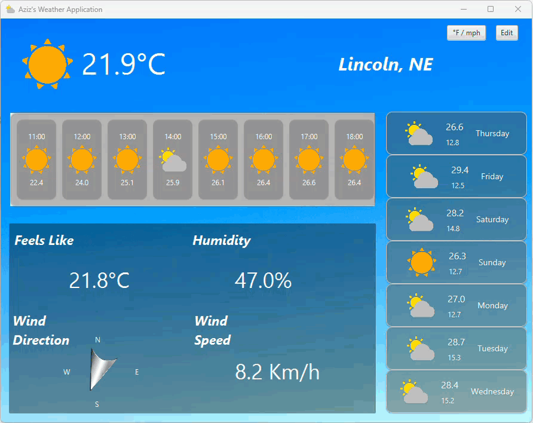

# Weather Program - JavaFX Desktop Application
### By: Aziz Tadzhibaev

## Overview
The weather program is a **desktop application** built using **Java** and **JavaFX**. This application provides a responsive and visually appealing user interface that allows users to enter a ZIP code, select preferred units for temperature, wind speed, and precipitation, and get real-time weather data. The program integrates with the **Open-Meteo** API for weather data retrieval and uses **SceneBuilder** to style the interface.

## Functionality
Upon starting the application, users are presented with a clean, visually-styled interface. The main features of the application include:

- **Automatic Zip Code retrieval from the IP of the user**: Upon starting the program, it retrieves weather data for the zip code provided by IP API.
- **ZIP Code Input**: Users enter a ZIP code to receive the weather information for the specified location.
- **Unit Conversion**: The user can switch between Celsius/Fahrenheit for temperature and kilometers/miles for wind speed and precipitation using a toggle button.
- **Weather Data Retrieval**: The app pulls weather data from the **Open-Meteo API** using the provided ZIP code.
- **Dynamic Icons**: Weather icons change based on the current weather conditions, and background images update according to the weather type (e.g., clear skies, thunderstorms).
- **Weekly and Hourly Forecast**: The app displays both weekly and hourly weather forecasts with temperature, wind speed, and weather codes.
- **Error Handling**: If an invalid ZIP code is entered, a **funny sound** is played to inform the user, and they are asked to re-enter a valid ZIP code.
- **Reset Feature**: A reset button allows users to quickly clear all fields and start fresh.

## Backend Logic
The backend logic of the application is split into several helper classes to ensure separation of concerns:
- **WeatherService**: Retrieves weather data from the **Open-Meteo API** and geolocation data from the **Zippopotam.us API**.
- **WeatherData and LocationData**: These serve as models to hold relevant weather and location information.
- **HourlyWeatherData and DailyWeatherData**: Store hourly and daily weather data respectively.
- **UnitConverter**: Converts weather data between metric and imperial units.
- **Validator**: Ensures that the entered ZIP code is valid before fetching weather data.
- **WeatherViewController**: Manages the user interface and connects the UI elements to the backend data.

## Purpose
This project was developed as the **final project** for my **Programming in Java** class. The goal was to apply knowledge of **JavaFX**, **APIs**, and **event-driven programming** to create a useful and interactive weather application. This project was an excellent exercise in understanding how to integrate **API data** into a Java application and provided hands-on experience with both **frontend and backend development**.

## How to Run
To run this application, you must have **JavaFX** installed and configured. You can launch the application using an **IDE** like **IntelliJ IDEA** with the proper VM options for JavaFX SDK. Ensure your **resource folders** are correctly marked so the application can find the necessary **FXML files** and **images**.

**Steps:**
1. Download or clone the repository.
2. Open the project in your preferred Java IDE (e.g., IntelliJ IDEA).
3. Ensure **JavaFX** is installed and properly configured in your project.
4. Run the `WeatherViewController` class or the main driver class to start the application.
5. Enter a valid ZIP code and enjoy checking the weather!

## Files and Resources
- **Images**: All weather icons and background images are stored in the `images/` folder. Ensure they are correctly referenced in your project.
- **Video**: Video of the running application showing all of its capabilities.
- **Sounds**: Error sound files are stored in the `sounds/` directory.

## Conclusion
This weather program offers a functional and visually engaging experience for users to check real-time weather forecasts. It highlights **JavaFX**'s capabilities in creating dynamic applications and serves as a great example of **API integration** and **event-driven programming**.
